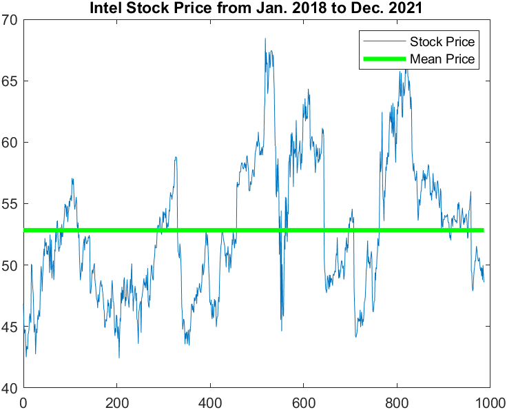
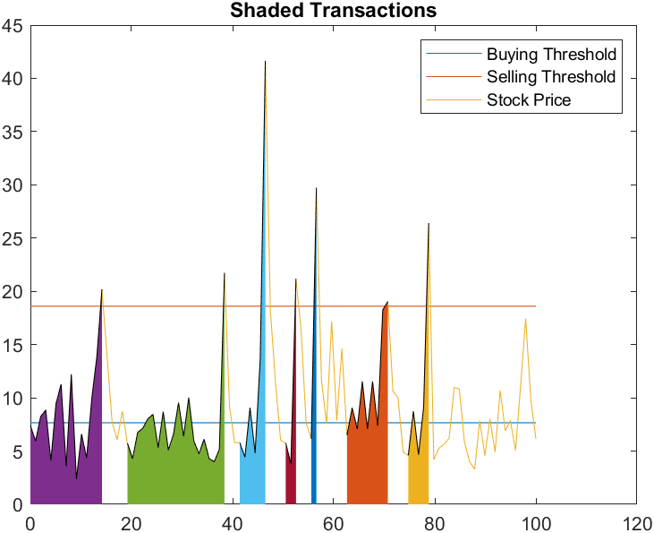
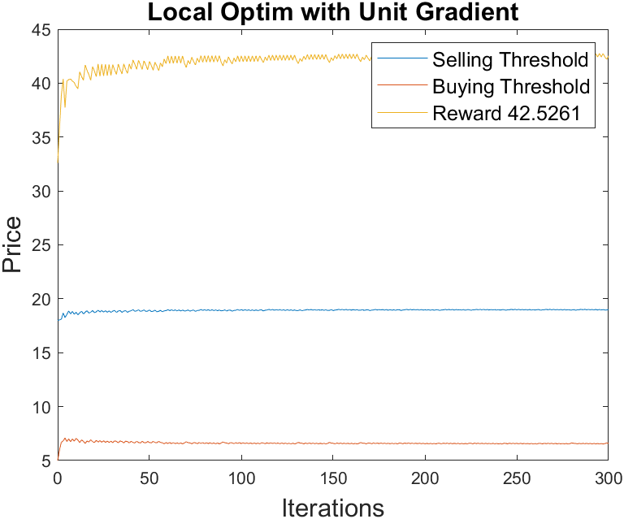
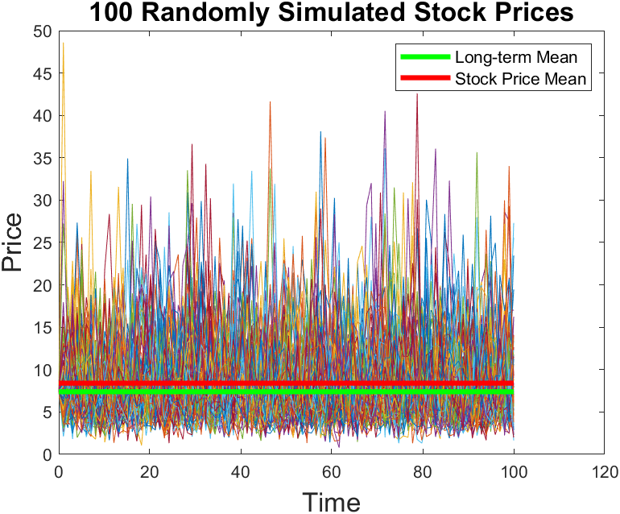
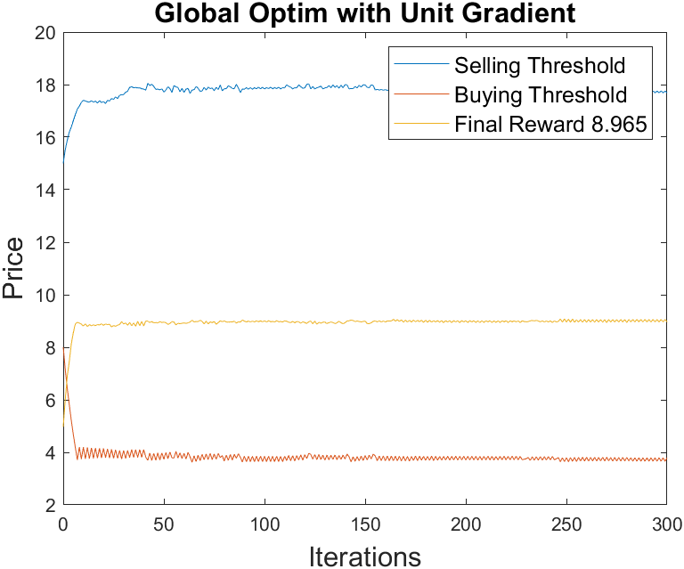
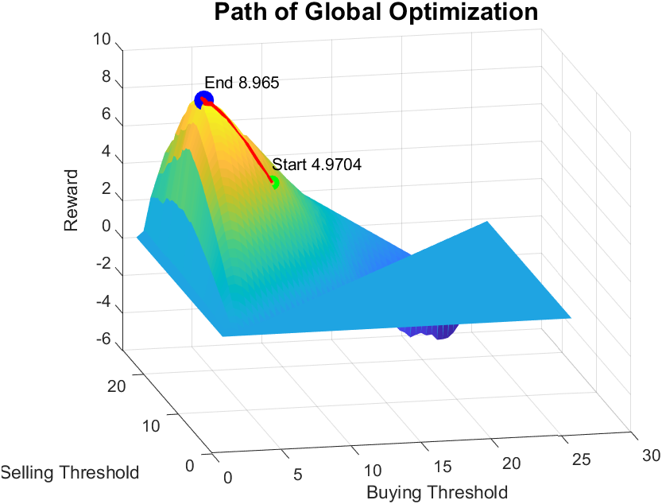

# Optimize buying-high and selling-low strategy for trading mean-reverting stock

This project implements and extends the stochastic approximation (SA) method present in Song et al.'s paper, "[Numerical methods for buying-low-and-selling-high stock policy](https://doi.org/10.1109/ACC.2008.4586627)." The goal of this SA algorithm is to find an optimal set of buying and selling thresholds for trading a stock with mean-reversion property. 

     

 

We present three different implementations of this SA method: local, global, local + global optimizations.

In Song et al.'s definition, the reward gain is defined as . 

The local method aims to maximize the total trading gain on one trend of stock prices. The total trading gain (objective) is the sum of reward gains on all possible transactions during a period.

  
  
   

 

The global method aims to maximize the trading gain on the first possible transaction of stock over N randomly simulated trends of stock prices. The trading gain (objective) is calculated as the mean of reward gain from the first possible transaction on all randomly simulated stock prices.

  
  
   

 

The local + global method optimizes the average of total trading gain on all possible transactions of N randomly simulated trends of stock prices.